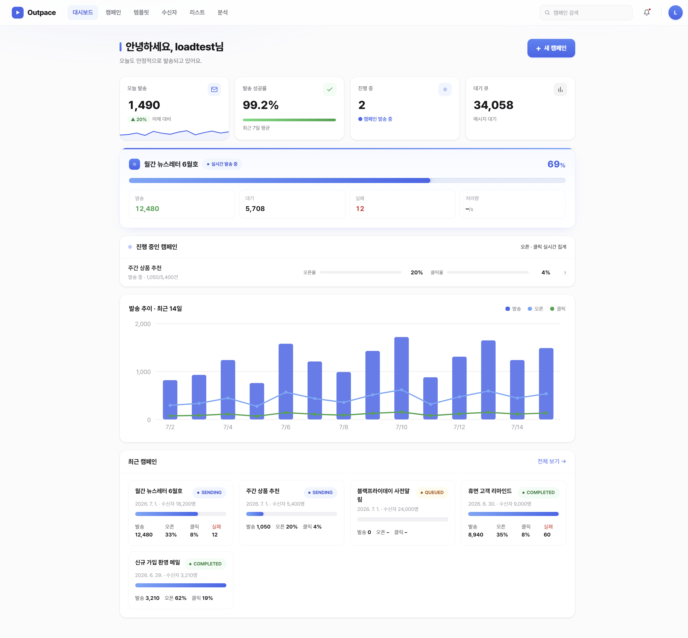
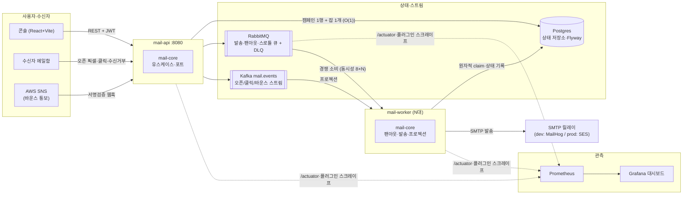

# mail-platform (POC)

대용량 이메일 발송 플랫폼의 MVP/POC. 핵심은 **API가 즉시 큐에 적재하고 반환하면, 별도 워커가 큐를 비동기로 드레인**하는 구조입니다 — 수신자 수와 무관하게 API 응답이 일정합니다.



## 기능

- **캠페인 발송** — 직접 작성 / 템플릿 스냅샷 / 연락처 리스트 팬아웃(워커가 비동기 확장 — 생성은 수신자 수와 무관하게 O(1)). 발신자(From) 지정, **예약 발송·취소**, **캠페인 기간**(수집 컷오프 — 종료 후 오픈/클릭 미집계), **임시저장·불러오기**(이전 캠페인 미리보기 딸린 2단 선택), **테스트 발송**(파이프라인 밖 "내게 먼저 보내기") + **발송 전 확인 모달**, 등록자 기록
- **A/B 테스트** — 이메일 해시 기반 결정적 분배, 전체의 N%만 테스트 발송 후 오픈/클릭 성과로 **승자 자동발송**(원자적 claim으로 1회 결정)
- **참여도 세그먼트** — 리스트 구독자 중 오픈/클릭률이 기준 이상인 수신자에게만 발송. 조건은 저장해 두고 **팬아웃(발송) 시점에 평가** — 예약 캠페인도 신선한 참여도로 거른다. 생성 폼에 예상 대상자 미리보기
- **템플릿** — `{{변수}}` 개인화(발송 시 수신자별 렌더링), 미리보기 API. 콘솔에서 **블록 에디터**(인라인 리치 편집·드래그&드롭·블록별 스타일/배경·이미지 업로드) / 텍스트 / HTML 에디터 제공
- **수신자/리스트** — 연락처 CRUD, CSV 임포트(+**수신 동의 기록**), 리스트 라벨, 구독 상태 관리(전역 억제 + **리스트 단위 옵트아웃** — 멤버십과 분리 기록이라 재임포트에도 유지), 수신자 **활동 타임라인**, 페이지드 테이블(서버 필터+배치 병합)
- **추적/분석** — 오픈 픽셀 + 클릭 리다이렉트 자체 구현, 캠페인별 오픈·클릭 지표와 **링크별 클릭 랭킹**, 실행 구간(시작~완료) 표시, 시간 버킷으로 집계된 발송 로그, **분석 대시보드**(전환 퍼널·링크 Top·수신자 건강도·요일×시각 오픈 히트맵)
- **수신거부·억제** — 메일 하단 수신거부 링크, suppression 목록이 발송 차단의 단일 진실원
- **바운스 웹훅** — 정규화된 통보 수신, HARD_BOUNCE/COMPLAINT 자동 억제, `X-Mail-Message-Id`로 메시지 상관 + **SES/SNS 어댑터**(아마존 서명검증 v1/v2, 구독 자동 승인 — SSRF 가드, SES 바운스/수신거부 신고 파서)
- **트랜잭셔널 단건 발송** — 템플릿+변수 즉시 렌더링, 동일 파이프라인 재사용
- **멀티테넌트 SaaS** — 가입=워크스페이스(회사) 등록, 관리자/운영자 역할, 루트 엔티티 워크스페이스 격리(남의 데이터는 404), 관리 페이지에서 **BYO 커넥터 선택**(SMTP/저장소를 회사 계정에 연결해 인프라 비용이 회사에 직접 청구되는 구조 — 연동은 로드맵) + **월 발송량 미터링 카드** + **테넌트별 발송 속도 제한**(토큰버킷 — 한도 초과 메일은 1초 파킹 큐로 우회, 다른 테넌트는 무영향)
- **메트릭 대시보드** — Micrometer→Prometheus→**Grafana**(파일 프로비저닝): 발송 처리량·큐 깊이·스로틀 거부율·SMTP p95·API·JVM 힙 6패널
- **JWT 인증**, 참여 이벤트는 **Kafka 스트림**(`mail.events`)으로 발행 → 워커가 읽기 모델로 프로젝션

## 구조



헥사고날(ports & adapters) — 의존성은 전부 `mail-core`를 향하고, core는 web/JPA/AMQP를 모릅니다.

```
mail-common   공유 DTO/enum (API·프론트 계약)
mail-core     도메인 + 포트 + 유스케이스 (CampaignService, MailDispatchService,
              CampaignScheduleService, TemplateService, ContactService, TrackingService, …)
infra         어댑터: JPA 저장소(Flyway 스키마), RabbitMQ 토폴로지/발행,
              Kafka 이벤트 발행, SMTP/로깅 MailSender, 로컬 파일 스토리지, JWT/BCrypt
mail-api      REST API (8080) — 캠페인/템플릿/수신자/리스트/업로드/추적/웹훅 + JWT 인증
mail-worker   백그라운드 워커 — @RabbitListener 발송/팬아웃 소비, Kafka 이벤트 프로젝션,
              예약 캠페인 릴리서(10초 주기), A/B 승자 스케줄러(30초 주기)
mail-admin    어드민 콘솔 (8081) — 부팅 셸 (확장 예정)
frontend      React 18 + Vite + react-router (5173) — 대시보드/캠페인/분석/템플릿 에디터/수신자/리스트/관리 콘솔
```

### 발송 파이프라인

```
POST /api/campaigns ──▶ PENDING 행 생성 + RabbitMQ 발행 ──▶ 201 즉시 반환
                          (예약이면 발행 보류 → 워커가 시각 도래 시 원자적 claim 후 릴리스)
워커: 메시지 claim(조건부 UPDATE, 이중발송 차단) → 억제 확인 → 개인화 렌더링
      → 추적 링크/픽셀/수신거부 삽입 → SMTP 발송 → SENT/BOUNCED 기록
오픈·클릭·바운스 ──▶ Kafka(mail.events) ──▶ 워커 프로젝션 ──▶ 캠페인 지표
```

상태: 캠페인 `QUEUED → EXPANDING → SENDING → COMPLETED`(EXPANDING은 리스트 팬아웃 동안만, 릴리스 전 예약은 CANCELED 가능), 메시지 `PENDING → SENDING → SENT | FAILED | BOUNCED | SUPPRESSED | CANCELED`. Postgres는 **상태 저장소**이고 큐는 RabbitMQ입니다. 스키마는 Flyway가 소유합니다(`infra/db/migration`).

## 확장성 — 측정으로 찾고, 고치고, 숫자로 증명

병목을 주장 대신 부하테스트(k6)로 찾고, 고친 뒤 같은 조건에서 재측정했습니다. 전체 기록: [loadtest/RESULTS.md](loadtest/RESULTS.md).

| 병목 | 무엇을 바꿨나 | Before | After | 개선 |
|---|---|---:|---:|---:|
| **캠페인 생성이 수신자 수에 선형** (5천 명 = 12.1초, 100만 외삽 40분+) | 동기 팬아웃 제거 — 생성은 **팬아웃 잡 1개만 발행**, 확장은 워커가 keyset 배치로 | 5천 명 12.1초 | 1천~10만 명 모두 **40~66ms 상수** | **~240×, O(N)→O(1)** |
| **드레인 처리량** (워커 1대, 5천 건) | 리스너 동시성 1→8 + 매 발송 7×COUNT를 EXISTS 1개로 + 복합 인덱스(V7) | 20.5 msg/s (E2E 244초) | **157.7 msg/s** (E2E 31.7초) | **~7.7×** |
| **워커 수평 확장의 정확성** | 원자적 조건부 UPDATE claim (PENDING→SENDING) | — | 동시 소비자 12개에서 **이중발송 0** (MailHog 수신 = 발송 수 정확 일치) | 정합성 유지 |
| **noisy neighbor** (A사 대량 발송 뒤에 B사가 줄 섬) | 워크스페이스별 토큰버킷(Postgres 원자적 UPDATE) + TTL 파킹 큐 | 공유 큐 순서대로 대기 | rate=3 설정 시 실효 **3.0 msg/s** 준수, 그 백로그가 도는 중 무제한 테넌트 10건 **0.3초** 완료 | 테넌트 격리 |

측정이 잡아준 것들: "SMTP가 병목일 것"이라는 추측이 틀렸음(MailHog 제거해도 +20%뿐 — 진짜 병목은 메시지당 DB 왕복), 워커 2대 증설(1.56×)보다 동시성 상향(7.7×)이 싼 레버라는 것, 그리고 단위 테스트가 놓친 무제한 테넌트 NPE까지 — 전부 재측정 단계에서 나왔습니다.

단계별 구현 해설(한국어): **[docs/logic/](docs/logic/README.md)** · 바운스 설계: [docs/bounce-webhook-design.md](docs/bounce-webhook-design.md)

## 실행

JDK 21 필요. (예: `JAVA_HOME=~/.jdks/corretto-21.x`)

```bash
# 0) 인프라 — Postgres + RabbitMQ + Kafka + MailHog
docker compose up -d          # 초기화는 docker compose down -v

# 1) API (8080) / 2) 워커 — 각각 별도 터미널
./gradlew :mail-api:bootRun
./gradlew :mail-worker:bootRun

# 3) 프론트엔드 콘솔
cd frontend && npm install && npm run dev   # http://localhost:5173

# 빌드/테스트
./gradlew build
```

- 발송된 메일 확인: **MailHog** http://localhost:8025 · 큐 상태: RabbitMQ UI http://localhost:15672 (guest/guest)
- 메트릭: **Grafana** http://localhost:3000/d/mail-platform (익명 열람) · Prometheus http://localhost:9090
- 설정은 전부 환경변수(`${ENV:dev-기본값}`) — 로컬은 무설정 동작, 프로덕션은 [.env.example](.env.example) 참고

### API 직접 호출

```bash
# 회원가입 → 토큰
TOKEN=$(curl -s -X POST localhost:8080/api/auth/signup -H "Content-Type: application/json" \
  -d '{"email":"me@example.com","password":"pass12345","displayName":"Me"}' | jq -r .token)

# 캠페인 생성 (발신자 지정 + 예약 발송 예시 — scheduledAt 생략 시 즉시)
curl -X POST localhost:8080/api/campaigns -H "Authorization: Bearer $TOKEN" -H "Content-Type: application/json" \
  -d '{"subject":"뉴스레터 {{name}}님","body":"<p>안녕하세요 {{name}}님</p>",
       "recipients":["a@x.com","b@x.com"],
       "senderName":"Acme 팀","senderEmail":"hello@acme.io",
       "scheduledAt":"2026-08-01T09:00:00Z"}'

# 진행률/지표 폴링 · 집계 발송 로그
curl -H "Authorization: Bearer $TOKEN" localhost:8080/api/campaigns/1
curl -H "Authorization: Bearer $TOKEN" "localhost:8080/api/campaigns/1/log"
```

응답의 `total/pending/sent/failed/bounced/suppressed` + `opened/clicked`로 진행·참여를 확인합니다.

## 다음 단계

- 실발송 전환(AWS SES) — **SNS 바운스 웹훅 코드는 완료**(서명검증·구독확인·파서), 남은 것은 AWS 콘솔 준비(도메인 검증·샌드박스 해제·SNS 구독): [docs/TODO-ses-sns.md](docs/TODO-ses-sns.md)
- 대용량 처리 — 부하 측정·워커 수평 확장·fan-out 병목 제거·테넌트 throttling·Grafana까지 완료, 남은 것은 suppression 블룸필터와 산출물 정리: [docs/ROADMAP-scale.md](docs/ROADMAP-scale.md)
